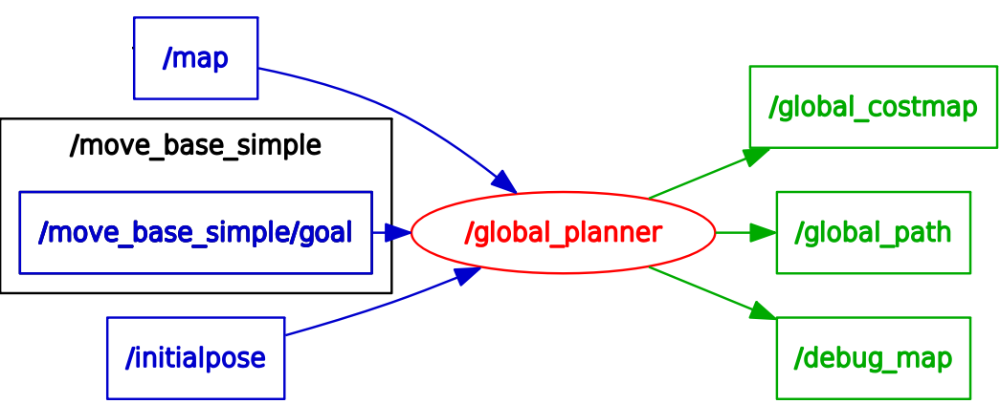

# A* algorithm 
self-developed A*/Dijkstra algorithm works on ROS. Shows on RVIZ

<div>
<figure  id="crackers1">
  
  </figure >
   <figure  id="crackers2">
  
   </figure >
<div style="float:middle;"></div>
</div>

 <div align="center">
  Dijkstra on left-hand-side and A* on right-hand-side
</div> 

<div>
<figure  id="crackers1">
  
  </figure >
   <figure  id="crackers2">
  
   </figure >
<div style="clean:both;"></div>
 <div align="center">
  Dijkstra on left-hand-side and A* on right-hand-side
</div>  

## Running 
Run A* algorithm 
```
$roslaunch lucky_navi global_planner.launch
```
<div>
<figure  id="crackers1">
  
<div style="clean:both;"></div>

## Subscribed Topics
* map(nav_msgs/OccupancyGrid)
Input a map to navigate. Can be set easily by "map_server". 

* move_base_simple/goal(geometry_msgs/PoseStamped)
Goal point. Can assigned by clicking buttom of RVIZ.

* initialpose (geometry_msgs/PoseWithCovarianceStamped)
Source point. Can assigned by clicking buttom of RVIZ.

## Published Topics
* global_path(nav_msgs/Path)
Path from 'initial_pose' to 'goal'

* global_costmap(nav_msgs/OccupancyGrid)
A static global costmap is generated in convenient for path planning.

* debug_map(nav_msgs/OccupancyGrid)
When 'show_debug_map' is set, then debug map will publish after goal is reached. 


## Parameters

~show_debug_map (Bool, default:True)
When set to true, An explored set will show up on map after goal is reached.

~explore_animate_intervel (int, default:30)
When set to non-zero, exploring animation will show on rviz, and update at specified frequency.

~use_time_analyse (Bool, default:false)
When set to true, A time spent analyse result will show on terminal.
~use_dijkstra (Bool, default:false)
When set to true, Dijkstra will be used to find path instead of using A*.

~obstacle_factor (float, default:0.1)
Conversion factor between distance and obstacle cost. Higher the value more it tend to avoid obstacle.

## Time analyse for A*
Analyse result on A* with debug_map and animation disabled.
```
4165131 function calls (4082350 primitive calls) in 2.897 seconds
   Ordered by: internal time
   ncalls  tottime  percall  cumtime  percall filename:lineno(function)
        1    0.554    0.554    2.897    2.897 global_planner.py:89(plan_do_it)
    79496    0.431    0.000    0.590    0.000 heapdict.py:39(_min_heapify)
   487299    0.407    0.000    0.407    0.000 global_planner.py:361(idx2XY)
  1186497    0.268    0.000    0.268    0.000 heapdict.py:69(_swap)
   243389    0.218    0.000    0.650    0.000 global_planner.py:176(dis_est)
    49873    0.176    0.000    0.722    0.000 heapdict.py:75(__delitem__)
    82781    0.136    0.000    1.059    0.000 heapdict.py:30(__setitem__)
    29624    0.129    0.000    0.149    0.000 global_planner.py:196(neighbor)
    79498    0.109    0.000    0.719    0.000 heapdict.py:93(popitem)
   284723    0.077    0.000    0.077    0.000 heapdict.py:85(__getitem__)
   122214    0.070    0.000    0.082    0.000 global_planner.py:386(neighbor_dist)
407370/324589    0.056    0.000    0.080    0.000 {len}
    82781    0.054    0.000    0.068    0.000 heapdict.py:60(_decrease_key)
   121693    0.053    0.000    0.053    0.000 global_planner.py:170(neighbor_delta_cost)
    49873    0.048    0.000    0.781    0.000 _abcoll.py:514(pop)
   318154    0.027    0.000    0.027    0.000 {method 'append' of 'list' objects}
   243389    0.026    0.000    0.026    0.000 {math.sqrt}
    82781    0.024    0.000    0.031    0.000 heapdict.py:105(__len__)
    79498    0.013    0.000    0.013    0.000 {method 'pop' of 'list' objects}
   122214    0.012    0.000    0.012    0.000 {abs}
     1049    0.003    0.000    0.005    0.000 rostime.py:198(__init__)
     1049    0.001    0.000    0.002    0.000 rostime.py:61(__init__)
      522    0.001    0.000    0.001    0.000 _Pose.py:37(__init__)
      525    0.001    0.000    0.002    0.000 rostime.py:183(get_rostime)
     1049    0.001    0.000    0.001    0.000 abc.py:128(__instancecheck__)
      522    0.001    0.000    0.006    0.000 _PoseStamped.py:62(__init__)
      525    0.000    0.000    0.002    0.000 rostime.py:127(__init__)
     1059    0.000    0.000    0.001    0.000 {isinstance}
      524    0.000    0.000    0.004    0.000 _Header.py:33(__init__)
     1049    0.000    0.000    0.000    0.000 _weakrefset.py:70(__contains__)
```
Calculation of cost happen in plan_do_it().
idx2XY() is to convert map indice into XY coordinate.
Priority Queue(heapdict) cost most of the time
# Lucky navigation 
Navigation and localization stack for AMR(Automumous mobile robot)
## Set up 
This project is build on Ubuntu 16.04, ROS-kinetic, Gazebo9


# Argument 

Run map split algorithm
```
$roslaunch lucky_navi map_spliter.launch
```

Invoke a willowgarage map 
global_cartographer.py genarate global costmap 
global_planner.py genarate 
Using simple goal on the map of rviz to assign a goal for A* 
TODO : 
Using argument to swtich debug flag 
Using costmap-like mark to show marking


Run simulation at Gazebo
```
$gazebo_amr_willowgarage.launch
```


Run simulation at Gazebo
```
$roslaunch lucky_navi lucky_navi.launch
```

## How to change map 


## Node and topic relationship

## Referance
