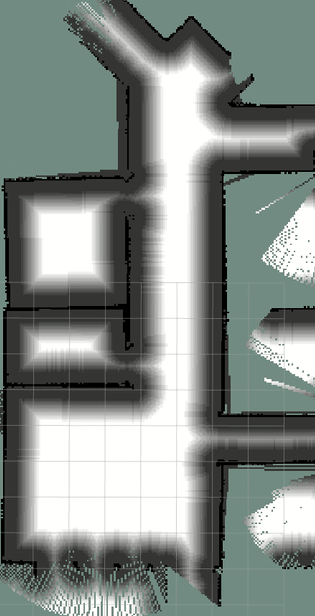

# A* algorithm 
Navigation and localization stack for AMR(Automumous mobile robot)

<div>
<figure  id="crackers1">
  
  </figure >
   <figure  id="crackers2">
  
   </figure >
<div style="float:middle;"></div>
</div>

 <div align="center">
  Dijkstra on left-hand-side and A* on right-hand-side
</div> 

<div>
<figure  id="crackers1">
  
  </figure >
   <figure  id="crackers2">
  
   </figure >
<div style="clean:both;"></div>
</div>
<center>Dijkstra on left-hand-side and A* on right-hand-side</center> | 


## Set up 
This project is build on Ubuntu 16.04, ROS-kinetic, Gazebo9

## Running 
Run A* algorithm 
```
$roslaunch lucky_navi global_planner.launch
```

# Argument 

Run map split algorithm
```
$roslaunch lucky_navi map_spliter.launch
```

Invoke a willowgarage map 
global_cartographer.py genarate global costmap 
global_planner.py genarate 
Using simple goal on the map of rviz to assign a goal for A* 
TODO : 
Using argument to swtich debug flag 
Using costmap-like mark to show marking


Run simulation at Gazebo
```
$gazebo_amr_willowgarage.launch
```


Run simulation at Gazebo
```
$roslaunch lucky_navi lucky_navi.launch
```

## How to change map 


## Node and topic relationship

## Referance
